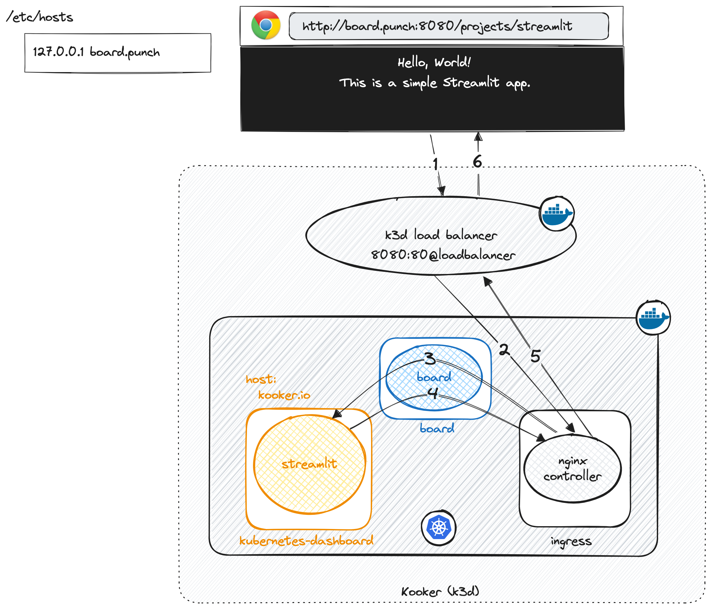

# Kooker

**K**ooker with a **K** is derived from the word *Cooker*. Like a cooker is used for 
making delicious recipes, Kooker cooks a (hopefully tasty) Punch recipe on top of K3D.

In short: Kooker deploys a Kubernetes cluster together with services such as Kafka, 
Elastic, Minio, Clickhouse.. using a tool called *kastctl* so that you can start 
kubernetes applications in minutes on any laptop as long as you have docker installed.

Kooker is developed by Punch and Kast Teams with best-effort support. We encourage you to contribute.  

* [Kooker Essential Design](#kooker-essential-design)
* [Getting Started](#getting-started)
* [Custom Deployment](#custom-deployment)
   * [Install a default platform](#install-a-default-platform)
   * [Interactively Install What you Want](#interactively-install-what-you-want)
   * [Define You Own Profile](#define-you-own-profile)
   * [Registries configuration file](#registries-configuration-file)
* [Typical Kooker Users and Usages](#typical-kooker-users-and-usages)
* [Requirements](#requirements)
   * [Hardware](#hardware)
   * [Software](#software)
* [Contributing](#contributing)
* [How-Tos](#how-tos)
   * [Develop using Kooker](#develop-using-kooker)
      * [Load a development image](#load-a-development-image)
      * [Restart a component](#restart-a-component)
      * [Check you work with the image you expect](#check-you-work-with-the-image-you-expect)
* [Troubleshooting](#Troubleshooting)
   * [punch operator does not install](#punch-operator-does-not-install)

<!-- Created by https://github.com/ekalinin/github-markdown-toc -->

# Getting Started

First type in 
```sh
./install.sh 
```
That generates a small setup environment script. Activate it as follows:
```sh
source activate.sh 
```

## Choose a ready to use kpack

Choose your use case by executing:
```sh
kooker kpack kpack/<choose your kpack deployment file here>
```
 As of today three kpacks are tested and working:
 * [kpack/kpack.yaml](./kpack/kpack.yaml): install a small K8 cluster with Minio, grafana; kube dashboard. The other kpack extend this simple one with more features.
 * [kpack/kpack.punch.yaml](./kpack/kpack.yaml): install a complete punch with Jupypunch, elasticsearch, kibana.
 * [kpack/kpack.hub.yaml](./kpack/kpack.yaml): install the innovation hub. It provides Kafka, Minio, and punch operators, artifact servers and board services. 

You can of course design your own kpack if you want something else. 
Once you have chosen, simply type in. 
```sh
# download deploy and start the required components.
kooker start 

# Expose all the required services to your host. This requires a sudoer
# password to patch your /etc/host file.
kooker expose 

# Just checking
kooker status

# Get the information about what is there and what are the exposed URLs
kooker info
```

## From there 

Once components are up, you can visit the various UI, for instance http://dashboard.punch:8080
or http://board.punch:8080 (if you selected the punch or hub application). 


# Kooker Essential Design

Kooker first bootstraps a k3d cluster, and next installs a number of additional components, the
ones you need. You can install any Kubernetes application as long as it is provided through helm
charts and container images. 

To play all these helm charts, and provide you with a simpler global configuration file (rather than
simply execute a bunch of disparate helm charts), Kooker uses a tool called *kastctl*.

Kastctl is developed by the (Kast) Thales teams and is a lightweight helm executor. The benefit
is to let you define your platform blueprint using a single simpler yaml file called *kpack.yaml*. 
Kastctl is publicly available as a (macOS|linux|windows) application and will be automatically
downloaded at startup time.

## Punch operator

In the sample kpack.hub.yaml and kpack.punch.yaml files you will see a punch Kubernetes operator. 
This operator is in charge of executing applications. The advantage of K8 operators it to benefit 
from a REST api, web hooks and many other high level means to manage your applications through (so-called)
Custom Resource Definition files. That makes it way easier to manage yoru application than producing a helm chart
for each.

## Punch Board

In addition a punch board application exposes a UI to interact with the platform, and provides also a 
lightweight reverse proxy that act as a Policy Enforcment Point. Together the punch board lets you 
deploy secured applications yet benefit from a UI and powerful APIs instead of struggling with
terminal commands. 

## Networking Architecture

Kooker exposes its various internal services to your local host.
Here is what you need to know. 

###  Default port mapping

Kooker is created with three rules to map port from your host laptop to internal kooker services:

* '8443:443'
* '8090:8090'
* '8080:80' 

These are handled by k3d load balancer that runs itself as a docker container. 

### Service external exposure

The following services are exposed:

* board.punch:8080 : is directed to a so called board application (punch or innovation or your own)running in namespace 'board'
* board.punch:8080/projects/someproject1: is directed to a serving pod (your app1) running in namespace 'someproject1'
* board.punch:8080/projects/someproject2: is directed to a serving pod (your app2) running in namespace 'someproject2'
* kooker.io:8080/dashboard.punch: is directed to the kubernetes dashboard
* kooker.io:8080/minio.punch: is directed to the S3 minio
* etc..

As you can see the 'projects' path is reserved for applications. 

.


# Custom Deployment

You have three ways to work with kooker: 

## Interactively Install What you Want

Instead or installing all the components defined in your kpack, you can type in: 
```sh
kooker --interactive start
```
The same kpack.yaml file is used, but you will be prompted to install only the components that 
you need from it. 

## Define You Own Profile 

You can define your own kpack.yaml file to include only the components you want. This requires
a kastctl documentation guide that is planned soon. 

In order to use your kpack file run the following command:

```sh
kooker kpack <kpack_file>
```
The kpack file you selected will then be used for the next installation. 

## Registries configuration file

You can add a *registries.yaml* file in the kooker directory containing images registries configuration.  Note that this file
is only used during the cluster creation.

# Typical Kooker Users and Usages 

Here are the Kooker users :

- Punch dev team : to develop and test Punch application, and to deploy third party components locally (elastic, Kafka ..)
- Punch and Kast professional services: to reproduce and investigate production issues.
- Any users which need a lightweight kube, and to deploy his own apps on it.

Note that Thales users benefit from access to Kast private image and helm charts repositories. 
This makes it easy to use Kooker to deploy components using the ones provided by Kast, and also configured
the way Kast propose to do it. Do not forget to configure Kast repo before using it (cf kastctl documentation)

If you have access to the Kast helm charts registry, please add the Kast helm repository manually as a prerequisite and run the command:

```sh
kooker kpack kpack/kpack_private.yaml
```

Non Thales user may only refer to their own or to public images and helm charts. 

As for Punch images and charts, they are publicly available from github repositories, hence usable by
everyone. 

# Requirements

## Hardware
- 4 vCPU
- 4.5 Go RAM
- 20 Go Disk (15Go are used by docker images)

You should increase those minimal requirements based on your usage of Kooker.

## Software

- docker
- curl
- bash

# Contributing 

Update the kpack file conf/kpack.yaml to add a new component using a kast or a 
custo helm chart

# How-Tos

## Using Helm

### List Helm charts for a component

```sh
helm list --namespace artifacts-server
```

### Get Helm values for a component

```sh
helm get values artifacts-server --namespace artifacts-server
```

## Develop using Kooker

### Load a development image

Say you want to reload the artifact server image you just regenerated from the sources.
Use:
```sh
kooker load-image ghcr.io/punchplatform/artifacts-server:8.1-dev
```

### Restart a component

Say you want to restart the artifact server pod. The preferred method is:
```sh
kubectl rollout restart deployment artifacts-server --namespace artifacts-server
```

Optionnally you can manually restart the pod. It will be restarted by K8:
```sh
kubectl delete pods artifacts-server-789f7655bd-lwqww --namespace artifacts-server
```

### Check you work with the image you expect

Ensure the sha256 signature of your image is what you expect. To do that
get the target pod identifier: 

```sh
kooker:[kooker]$ kubectl get pods --namespace=artifacts-server
```
which outputs:
```sh
NAME                               READY   STATUS    RESTARTS   AGE
artifacts-server-64b769944-jmhbl   1/1     Running   0          2m49s
```
Then :
```sh
kooker:[kooker]$ kubectl get pod --namespace=artifacts-server artifacts-server-64b769944-jmhbl -o json | jq '.status.containerStatuses[] | { "image": .image, "imageID": .imageID }'
```
That produces something like
```json
{
  "image": "ghcr.io/punchplatform/artifacts-server:8.1-dev",
  "imageID": "sha256:66f345214703dfcb3204ec7114656f745dd76596a436d03e53bb136916cf4c11"
}
```

# Troubleshooting

### punch operator does not install 

You have the following message:
```sh
2:58PM ERR Error: UPGRADE FAILED: "punch-operator" has no deployed releases
```
Try stopping the punch-operator then restart it. The problem is caused by the CRDs not uninstalled every time the operator is recreated.
This makes start command fail, even if there is no new release of the punch-operator. 