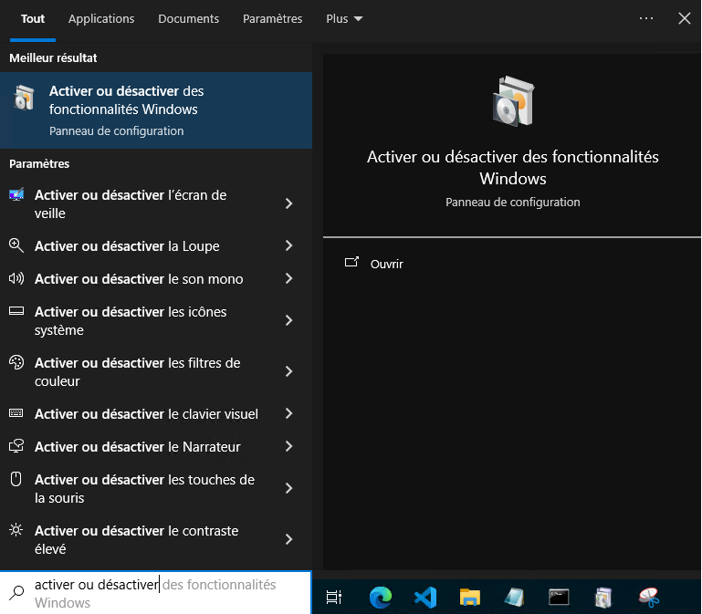
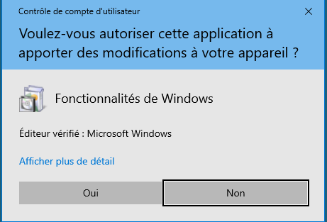
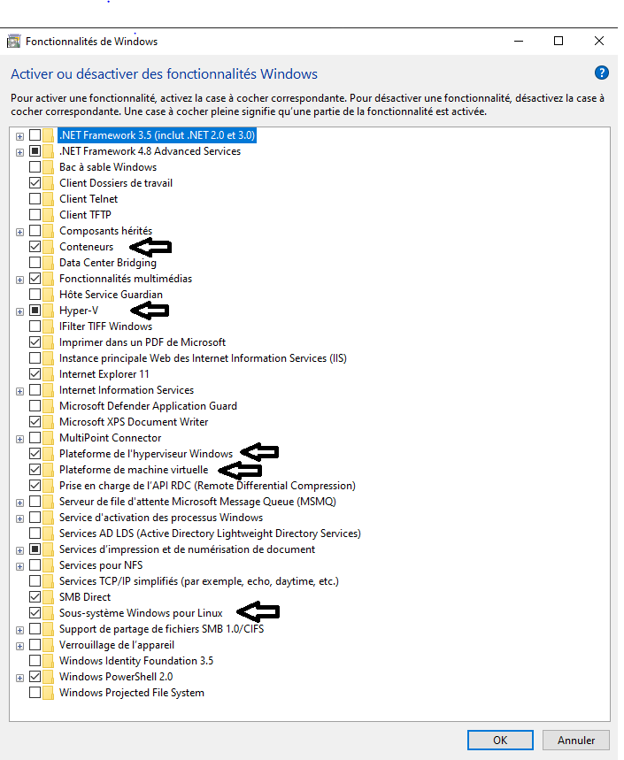

# Installation of kooker on VM Windows powered by HyperV to use WSL

## Introduction

This document describes how to configure VM Windows powered by HyperV to run kooker.
WARNING: copyping multiple command lines in the prompt can fail.

## Environnement de tests

Logical or material component | Version | Information
 --- | --- | ---
Host OS  | Windows 10 21h2 | Build : 19044.3930
HyperV | 10.0.19041.1 | unmodified version
OS of the HyperV VM |  Windows 10 21h2 | Build: 19044.3930
wsl | 2.0.14.0 | kernel 5.15.133.1-1
wsl OS | Ubuntu 22.04 LTS | kernel 5.15.131.1-microsoft-standard-WLS2 x84-64
Docker |  25.0.1 | build 29cf629 version on the ubuntu VM WSL2

## Configuration on the host machine
<b>Please note, you must first shut down the Windows VM in order to make this modification.<b>

To activate nested virtualization, run this command in Powershell on the host machine : 
``` 
Set-VMProcessor -VMName <VMName> -ExposeVirtualizationExtensions $true
```
Replacing VMName with the name of your VM in HyperV. This step is essential in order to be able to run a virtual machine from within a machine which is also virtualized.

Once this step is completed the configuration of the host machine is over.


## Configuration of the Windows VM

The Windows 10 VM already has WSL but it isn't functionnal. Several Powershell command instructions need to be run as administrator to repair it.

### Activating WSL
#### Through PowerShell command line

This command activate Windows sub-system for Linux

```
dism.exe /online /enable-feature /featurename:Microsoft-Windows-Subsystem-Linux /all /norestart
```

Then, activate virtual machine functionality :

```
dism.exe /online /enable-feature /featurename:VirtualMachinePlatform /all /norestart
```

#### Through Windows interface

Go to this interface :



Press "yes" for administrator execution rights :



Once the window open, tick all functionalities indicated with an arrow :



Press "Ok". A window pop with a loading bar, this can take a while.


Once terminated, another pop-up should appear, asking to restart the VM. This can also take a while for the VM to shut down and restart.

###  Update and define WSL2 as default

Before updating it is advised to restart the VM throught the "start menu" in order to finalize the activation of the Windows settings previously ticked. 

Next, update WSL with this command on the Windows VM :

```
wsl --update --web-download
```

Define WSL vestion to 2 :

```
wsl --set-default-version 2
```

### Pulling Ubuntu image for WSL

The Punch team has the responsibility for providing this image.

In order to install and configure this image, you need to first pull the image package on Ubuntu website :

``` 
https://cloud-images.ubuntu.com/wsl/jammy/current/ubuntu-jammy-wsl-amd64-wsl.rootfs.tar.gz
```


## Installation and configuration of the WSL2 Ubuntu image
### Installation of the Ubuntu image

First you need to import the archive file (.tar.gz) containing the image for WSL2

In order to do that, run a command line interface with administrator execution rights and navigate to the folder where your archive is :

```
cd C:\Users\YourUserName\Downloads
```
In this case, Downloads folder.

Then create a folder in which the data will be stored (used as disk space for the WSL2 image), for example, C:\Users\YourUserName\Documents\Ubuntu

Run this command to import the WSL2 image :

```
wsl --import ubuntu2 C:\Users\YourUserName\Documents\Ubuntu C:\Users\YourUserName\Downloads\ubuntu-jammy-wsl-amd64-wsl.rootfs.tar.gz
```

A pop-up should appear in the command line interface to notify the import was successful.

To check that the image was correctly imported run :

```
wsl --list
```
Result : 


Your instance of Ubuntu is now available from your CLI or from your Windows VM Powershell.

### Configuration of the WSL2 instance

To connect to your VM through CLI, run :

```
wsl -d ubuntu2
```

Result : 


The default user is root. To prevent potential issues it is advised to create a sudoer account.

Create an user: 
```
adduser yourUser
```

Set a password when prompted.

Add this user to the sudo group:
```
usermod -aG sudo yourUser
```

Connect as this user :
```
su - yourUser
```

You have to enable systemctl for your ubuntu instance, in order to do that :
Create this file /etc/wsl.conf with nano or vi:
```
sudo vi /etc/wsl.conf
```

Edit the file with this content: 
```
[boot]
systemd=true
```

Then restart the ubuntu instance in the command line of the Windows host: 
```
wsl --shutdown
```
Then reconnect yourself on the WSL Ubuntu instance, as yourUser, to proceed with the configuration.

You have to set up the proxy configuration in order to access web resources and to install docker.
Change value "http://your_proxy:your_port" to add your url proxy.
Through the WSL instance CLI, run :

```
export http_proxy="http://your_proxy:your_port"
export https_proxy="http://your_proxy:your_port"
export ftp_proxy="http://your_proxy:your_port"
export HTTP_PROXY="http://your_proxy:your_port"
export HTTPS_PROXY="http://your_proxy:your_port"
export FTP_PROXY="http://your_proxy:your_port"
```

These commands can also be placed in the .bashrc file or in the .profile file in the $HOME directory of your user if you want them persistent.

Then, you have to update packages of the Ubuntu instance. Run :

```
sudo -E apt update 
sudo -E apt upgrade
```

The instance is now up to date, next step is installing docker engine.
Before installing, remove any potential persistent files and packages with this command : 

```
for pkg in docker.io docker-doc docker-compose docker-compose-v2 podman-docker containerd runc; do sudo apt-get remove $pkg; done
```

Then download the key needed to pull docker :

```
sudo -E apt-get update
sudo -E apt-get install ca-certificates curl gnupg
```

Then :
```
sudo install -m 0755 -d /etc/apt/keyrings
```

Next:
```
curl -fsSL https://download.docker.com/linux/ubuntu/gpg | sudo gpg --dearmor -o /etc/apt/keyrings/docker.gpg
```

Finally:
```
sudo chmod a+r /etc/apt/keyrings/docker.gpg
```

# Add the repository to Apt sources:
```
echo \
  "deb [arch=$(dpkg --print-architecture) signed-by=/etc/apt/keyrings/docker.gpg] https://download.docker.com/linux/ubuntu \
  $(. /etc/os-release && echo "$VERSION_CODENAME") stable" | \
  sudo tee /etc/apt/sources.list.d/docker.list > /dev/null
```

Then :
```
sudo -E apt-get update
```

Finally install Docker : 

```
sudo -E apt-get install docker-ce docker-ce-cli containerd.io docker-buildx-plugin docker-compose-plugin
```


Then create this file (the path of the file will be created if it doesn't exist):

```
sudo mkdir -p /etc/systemd/system/docker.service.d
```

Then edit the created configuration file with nano or vi :


```
sudo nano /etc/systemd/system/docker.service.d/http-proxy.conf
```
Change value "http://your_proxy:your_port" to add your url proxy.
To add the followings lines for proxy configuration :

```
[Service]
Environment="HTTP_PROXY=http://your_proxy:your_port"
Environment="HTTPS_PROXY=http://your_proxy:your_port"
Environment="FTP_PROXY=http://your_proxy:your_port"
```

Finally, restart the daemon and service of docker :

```
sudo systemctl daemon-reload
sudo service docker restart
```

To verify that Docker is properly installed run :

```
sudo docker run hello-world
```

To prevent from using sudo command everytime, create a docker group and add your user to this group using :

```
sudo groupadd docker
sudo usermod -aG docker $USER
newgrp docker
```
Test it with :
```
docker run hello-world
```
Then restart docker service to update docker with the user configuration :

```
sudo systemctl enable docker.service
sudo systemctl enable containerd.service
```

You also have to set the proxy for docker in order to be able to pull images. 
In order to do that you first have to define these environment variables :
```
export no_proxy="127.0.0.1,localhost,0.0.0.0,dashboard.punch,minio-api.punch,minio.punch,artifacts-server.punch,kibana.punch,grafana.punch,board.punch,spark.punch,jupyerhub.punch,172.0.0.0/8"
export NO_PROXY="127.0.0.1,localhost,0.0.0.0,dashboard.punch,minio-api.punch,minio.punch,artifacts-server.punch,kibana.punch,grafana.punch,board.punch,spark.punch,jupyerhub.punch,172.0.0.0/8"
```

no_proxy and NO_PROXY allows to ignore the proxy server to avoid redirects on the IP of the local Kooker cluster.
These commands can also be placed in the .bashrc file or in the .profile file in the $HOME directory of your user.

### What is kooker ?
It is a set of tools allowing the deployment of a Kubernetes cluster with punch feature.

See the [documentation](https://punch-1.gitbook.io/punch-doc/v/punch-8.1/#kooker) for more information.

Once these configuration steps are done, you have to clone kooker sources from the punch github :
### Kooker through git

```
git clone https://github.com/punchplatform/kooker.git
```

### Kooker through http

```
curl https://codeload.github.com/punchplatform/kooker/zip/refs/heads/main
```

Then extract the zip file :

```
unzip kooker-main.zip
```

If unzip command isn't available, install it :

```
sudo -E apt install unzip
```

Where Kooker was clone and unzipped, enter the directory :

```
cd kooker
```

Run the installation script :

```
./install.sh 
```

Once the script is finished running, source the activation script :

```
source activate.sh 
```

Then run kooker to install the helm packages it provides: 

```
kooker start
```

Expose kooker services through URL:


```
kooker expose 
```

To get kooker status and cluster info :

```
kooker status
kooker info
```

Finally, you have to edit the hosts file of the windows VM with the URL exposed by the Kubernetes cluster of kooker :

In Windows, edit the "hosts" file in the following path. Please note that this hosts file cannot be modified directly via a text editing tool: :

```
C:\Windows\System32\drivers\etc
```

It is better to copy and paste onto your desktop then add the following lines:

```
127.0.0.1 dashboard.punch
127.0.0.1 minio-api.punch
127.0.0.1 minio.punch
127.0.0.1 grafana.punch
```

Then copy and paste the modified file into the original directory.


Finally, you will need to renew the DNS to have access to our domain names via the administrator command prompt: 

```
ipconfig /flushdns
```

To carry out the tests, simply go to a browser from your Windows VM and go to the following links:

```
http://dashboard.punch:8080
http://minio.punch:8080
http://minio-api.punch:8080
http://kibana.punch:8080
http://grafana.punch:8080
http://board.punch:8080
```


There are specific Kpacks for the deployment of the innovation hub or for punch applications.
See the documentation [here](https://github.com/punchplatform/kooker)